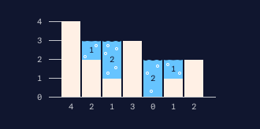

# Water Stats

Necesitamos crear una **waterAccumulation** que tome una lista de alturas y devuelva la cantidad de agua de lluvia que podría contener esa matriz.

Por ejemplo, la lista[4, 2, 1, 3, 0, 1, 2] se puede representar en el siguiente histograma:

Como puede ver, hay 6 unidades de agua que se pueden contener, por lo que capturar el agua de lluvia ([4, 2, 1, 3, 0, 1, 2]) devolverá 6.
